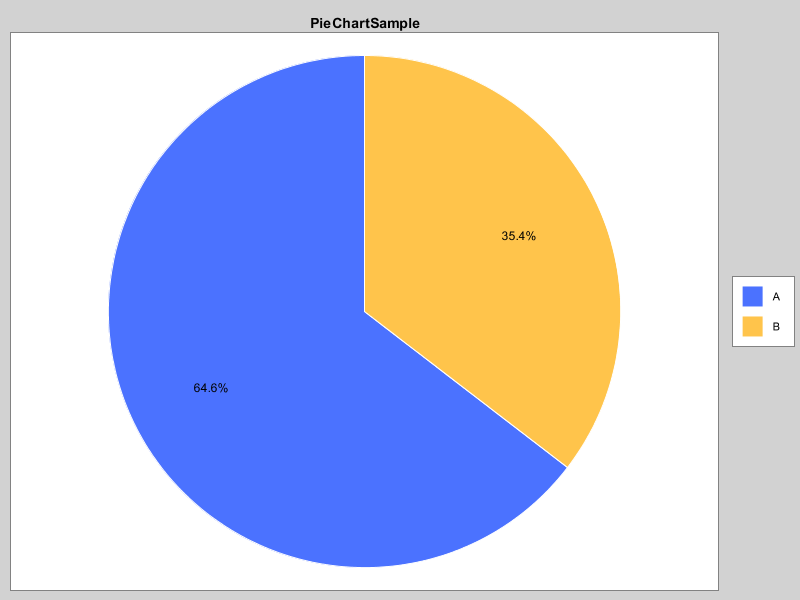

# Java Visulization EPITA

This project is about Data Visualization in Java using 
# survived and dead of male and female in different Pclass

# age category in survided

# total number of male and female on board

# total number of srivived and dead between male and female on board

# graph fare vs age

